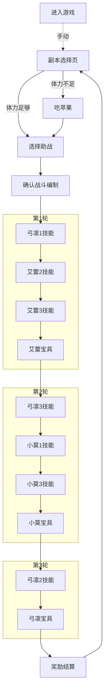

# FGO-AirTester.air

> 此为网易游戏在中山大学计算机科学与技术专业2019~2020学年第一学期开设的选修课程《移动互联网编程实践》作业。

基于OpenCV和网易Airtest部署的FGO“打开宝物库之门”副本自动脚本。

## 作业主题

游戏的性能测试

## 作业内容

选择一款你喜欢的游戏，设计一段性能测试用例并执行测试，给出分析报告。

## 作业要求

- 测试用例：用思维导图描述测试方案
- 性能指标：列举指标及其具体含义
- 工具：若使用现有工具，介绍其使用方法
- 开发：根据需要可以适当开发，描述开发目的、思路及效果
- 结果分析：描述发现的性能问题（如果有）并分析原因，或者解释测试中的现象
- 平台：不限（安卓，IOS，Windows等）
- 展示：挑选优秀作业展示
- 诚信：独立完成

## 实验环境

### 测试游戏

[Fate Grand Order](https://game.bilibili.com/fgo/)，国服版本号为v1.55.244193。下述介绍截取自游戏官网。

> Fate系列首款正版手游，100万字剧情描绘史上最大圣杯战争！《FGO》剧情原案由Fate之父奈须蘑菇亲自执笔，长达100万字的小说级故事线将为您揭露多重背景设定！
>
> 史上最多英灵集结，跨越时代的终极召唤！在《FGO》中可召唤的从者包含了《Fate/Zero》、《Fate/stay night》等多部知名Fate作品中的经典角色，以及多位《FGO》首创英灵与您展开命运的羁绊，更有全新职阶首次于Fate系列中登场！
>
> 指令卡式战斗，原汁原味的日式RPG！在《FGO》中，战斗通过对从者下达的命令用指令卡来表现，通过回合制的形式展开指令战斗。战斗分为战术阶段与指令阶段，根据您的选择，从者会分别发动攻击。己方攻击后，转为敌方行动。敌方行动后一回合结束。
>
> 50多位知名画师参与英灵绘制，40位以上声优倾情献声！《FGO》力邀武内崇在内的50余位知名画师组成超豪华美术团队，更特邀Fate系列原班声优参与配音！

### 测试工具

#### 自动化工具

[Airtest Windows(64bit) v1.2.2](http://airtest.netease.com/index.html)

Airtest是由网易开源的一款基于OpenCV的跨平台的UI自动化框架，适用于游戏和App。下述介绍来自于[GitHub上的开源仓库](https://github.com/AirtestProject/Airtest/blob/master/README_zh.md)。

> - 各种运行：Airtest提供了跨平台的API，包括安装应用、模拟输入、断言等。 基于图像识别技术定位UI元素，你无需嵌入任何代码即可进行自动化。
> - 扩展性：Airtest提供了命令行和python接口，可以很容易地在大规模设备集群上运行。自动生成的HTML报告，包含详细步骤和录屏，让你迅速定位失败点。
> - AirtestIDE： 是一个强大的GUI工具，可以帮助你录制和调试自动化脚本。 AirtestIDE支持了完整的自动化流程：录制脚本->真机回放->生成报告。
> - Poco: Poco 框架可以直接访问UI控件，支持主流平台和游戏引擎。通过Python API操作UI控件，可以实现更强大的自动化控制。

#### 性能测试工具

[PerfDog v3.2.191204](https://perfdog.qq.com/)

腾讯WeTest明星工具PerfDog在2019年11月正式对外发布（非常新的工具喔）。PerfDog作为一款性能测试和分析工具，支持全平台的应用形态测试，包括Android、iOS、小游戏、小程序、H5等。且Android设备无需ROOT，iOS设备也无需越狱，能非常高效地解决两大系统测试分析的难题，提高测试工作的效率。

### 开发环境

[VAIO Z Flip](https://us.vaio.com/products/vaio-z-flip)

- Intel(R) Core(TM) i7-6567U CPU @3.30GHZ 3.31GHz
- 8.00GB RAM
- Windows 10, 64-bit (Build 17763) 10.0.17763

### 测试平台

[Sony Xperia 10](https://www.sonymobile.com/hk/products/phones/xperia-10/)

- Qualcomm(R) Snapdragon(TM) 630
- 4.00GB RAM, 64.00GB ROM
- Android 9.0 (Pie)
- 1080 x 2520 pixels, 21:9 ratio, 6.0 inches, IPS LCD capacitive touchscreen
- 2870 mAh Battery

虽然是今年春季发布的新机器，但是配置非常之低，索尼大法诚不坑我…不过，卡牌类游戏对设备要求低，玩家Android多低端设备多样性带来设备适配问题，因此使用这台手机（不仅是因为穷）所得到的测试结果也十分有参考意义。

## 测试用例

完整测试视频地址：<https://www.bilibili.com/video/av80128598/>

我针对FGO的QP（打开宝物库之门）副本开发了一个自动化脚本，并开源在github上：<https://github.com/wu-kan/FGO-AirTester.air>

下图是我使用的队伍编制。由于自动化测试过程中我希望尽量避免考虑额外的情况，因此没有使用热门的双CBA+狂兰/伯爵的配置（依赖好友助战）。这个配置的方便之处在于，三轮战斗都只要靠丢技能和宝具就可以过关，不依赖于指令卡、助战和Master技能。

下面是一个完整的测试的流程图，这样安排技能和宝具的顺序可以最大化输出。

## 性能指标

## 结果分析

在线查看性能测试数据<https://perfdog.qq.com/case_detail/336356>，Password: KBKmyX
